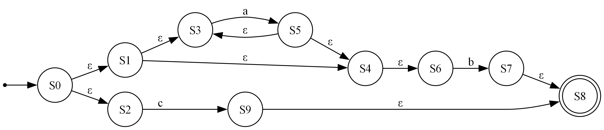
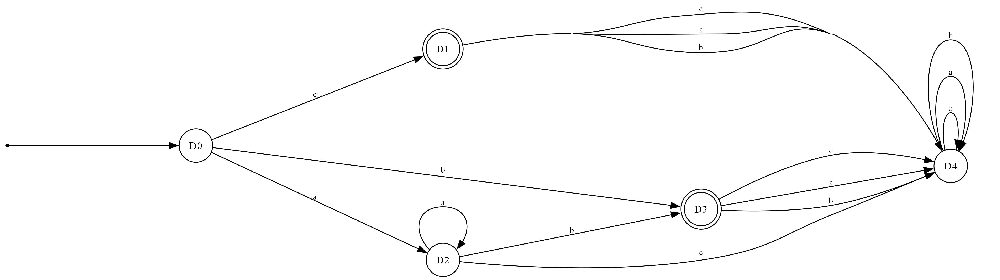

# nfa-dfa-converter

Conversor de expresiones regulares a autómatas finitos (regex a NFA y de NFA a DFA), con exportación a imágenes y una interfaz gráfica. Nació como actividad integradora de un curso de autómatas y sirve para estudiar cómo se construyen estos autómatas paso a paso.

## Ejemplo con la expresión `a*b+c`

| NFA (construcción de Thompson) | DFA (por subconjuntos) |
| --- | --- |
|  |  |

<sub>Imágenes generadas por el propio programa con Graphviz. La interfaz gráfica muestra estas mismas imágenes con zoom.</sub>

## Qué hace

- `postfix.py` agrega la concatenación explícita y pasa la expresión a notación postfix con el algoritmo shunting-yard.
- `NFA.py` construye el NFA con la construcción de Thompson, lo exporta a DOT y permite simular cadenas.
- `nfa_to_dfa.py` convierte el NFA a DFA por subconjuntos, con estado trampa, y lo exporta a DOT.
- `gui.py` es la interfaz en Tkinter: escribes la expresión, genera ambos autómatas, los muestra con zoom y desplazamiento, tiene modo oscuro y valida palabras contra el autómata.
- `main.py` corre todo desde la línea de comandos con la expresión de ejemplo.

## Tecnologías

Python, Tkinter, Pillow y Graphviz.

## Cómo correrlo

Necesitas Python 3 y el programa `dot` de Graphviz disponible en el PATH.

```bash
pip install pillow pandas numpy
python gui.py
```

Para la versión de línea de comandos, que genera `nfaa.dot`, `nfaa.png`, `dfa.dot` y `dfa.png`:

```bash
python main.py
```
